# Lab7web
# Nama : Muhammad Din Al Ayubi
# Kelas : TI.22.A3
# NIM : 312210293

## Instruksi Praktikum
1. Persiapkan text editor misalnya VSCode.
2. Buat folder baru dengan nama lab7_php_dasar pada docroot webserver (htdocs)
3. Ikuti langkah-langkah praktikum yang akan dijelaskan berikutnya.
* Langkah-langkah Praktikum
### Persiapan
#### Untuk memulai membuat kode php, perlu disiapkan web server dan interpreter PHP terlebih dahulu. Web servar yang kita gunakan adalah Apache 2 dan interpreter PHP 7. Untuk memudahkan proses praktikum, kita gunakan aplikasi bundle web server yaitu ```XAMPP.```
```Install XAMPP```
#### Unduh XAMPP dari ```https://www.apachefriends.org/download.html``` dan pilih versi portable untuk memudahkan proses installasi. Kemudian extract file tersebut, seusikan direktorinya ```(misal: c:\xampp).```
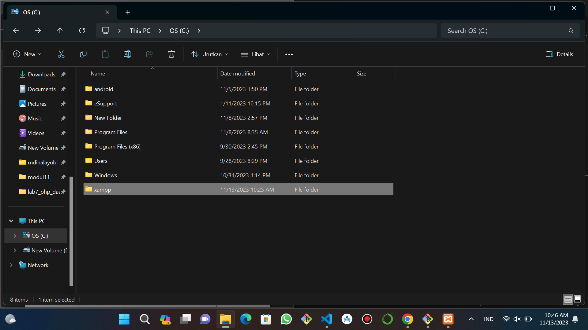
#### Konfigurasi Web Server
• Konfigurasi Apache
#### Untuk konfigurasi HTTP server, seperti port yang digunakan akses HTTP, modul yang diaktifkan, lokasi document root, dll.
#### Lokasi file: ```\xampp\apache\conf\httpd.conf```
• Konfigrasi PHP
#### Untuk konfigurasi perilaku engine PHP yang berefek pada keamanan dan performa. Seperti batas maksimal waktu eksekusi script, batas file yang dapat diupload, error reporting, dll.
#### Lokasi file: ```\xampp\php\php.ini```
• Konfigrasi MySql
#### Konfigurasi server MySQL, seperti administrator user, port, timezone, dll.
#### Lokasi file: ```\xampp\mysql\bin\my.ini```
#### Menjalankan Web Server
##### ntuk menjalankan web server dari menu XAMPP Control.
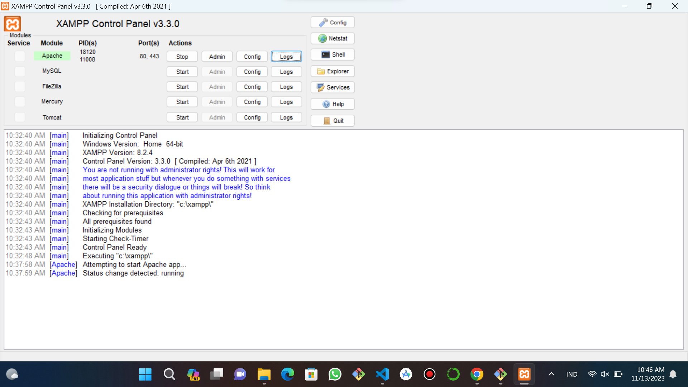
• Uji coba apakah server sudah berkerja dengan baik
##### ```vhttp://127.0.0.1``` atau ```http://localhost```
##### Tampil halaman utama XAMPP jika server sudah berkerja dengan baik.
• Dokumen Website
##### Semua file website tempatkan di direktori: ```\xampp\htdocs\```
• Database MySQL
##### Direktori: ```\xampp\mysql\```
##### Manajemen database: ```http://localhost/phpmyadmin```
##### Memulai PHP
##### Buat folder lab7_php_dasar pada root directory web server ```(c:\xampp\htdocs)```
##### Kemudian untuk mengakses direktory tersebut pada web server dengan mengakses URL: ```http://localhost/lab7_php_dasar/```
##### PHP Dasar
##### Buat file baru dengan nama php_dasar.php pada directory tersebut. Kemudian buat kode seperti berikut.
```python
<!DOCTYPE html>
<html lang="en">
<head>
    <meta charset="UTF-8">
    <title>PHP Dasar</title>
</head>
<body>
    <h1>Belajar PHP Dasar</h1>
    <?php
        echo "Hello World";
    ?>
```
##### Kemudian untuk mengakses hasilnya melalui URL: ```http://localhost/lab7_php_dasar/php_dasar.php```
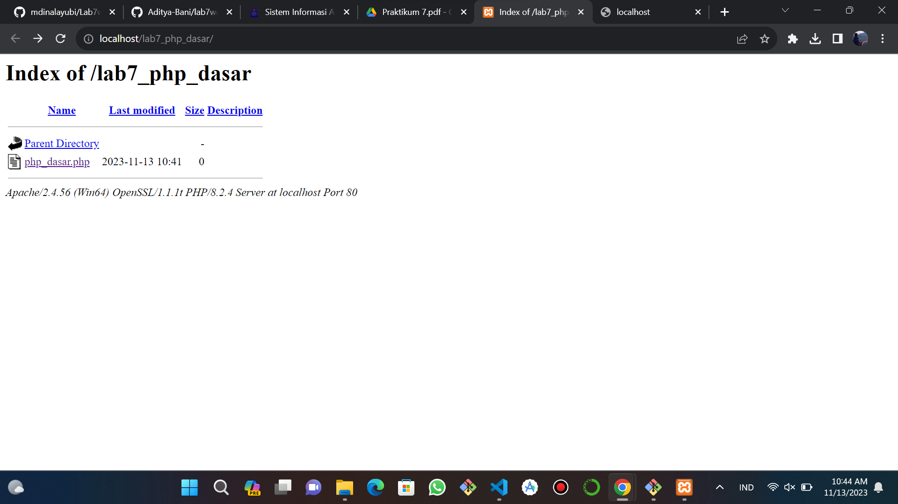
##### Variable PHP
##### Menambahkan variable pada program.
```python
<h1>Menggunakan Variable</h1>
    <?php
    $nim = "312210293";
    $nama = 'Muhammad Din Al Ayubi';
    echo "NIM : " . $nim . "<br>";
    echo "Nama : $nama";
    ?>
```
##### Hasil Output
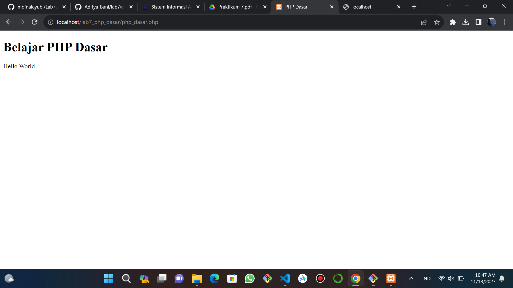
##### Predefine Variable $_GET
```pyhton
 <h1>Predefine Variable</h1>
    <?php
    echo "Selamat Datang " . $_GET ["nama"];
    ?>
</body>
</html>
```
##### Hasil Output
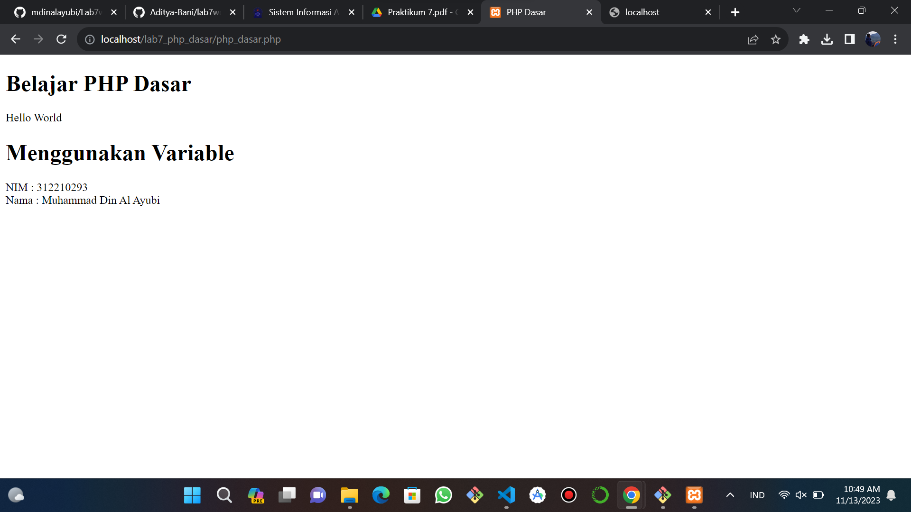
##### Untuk mengaksesnya gunakan URL: ```http://localhost/lab7_php_dasar/php_dasar.php?nama=Muhammad Din Al Ayubi```
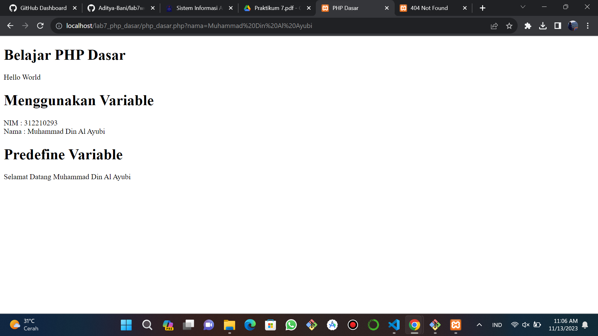
##### Membuat Form Input
```python
<!DOCTYPE html>
<html lang="en">
<head>
    <meta charset="UTF-8">
    <title>PHP Dasar</title>
</head>
<body>
<h2>Form Input</h2>
<form method="post">
    <label>Nama: </label>
    <input type="text" name="nama">
    <input type="submit" value="Kirim">
</form>
<?php
  echo "Selamat Datang " . $_GET ["nama"];
?>
```
##### Hasil Output
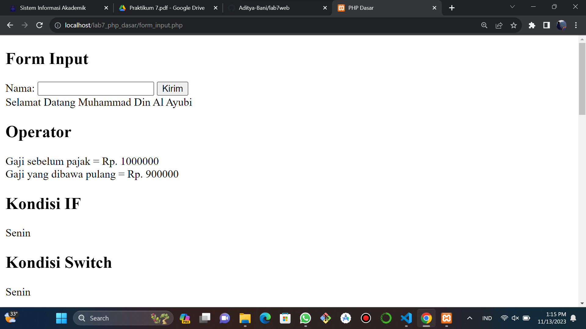
##### Operator
```python
<h2>Operator</h2>
<?php
$gaji = 1000000;
$pajak = 0.1;
$thp = $gaji - ($gaji*$pajak);
echo "Gaji sebelum pajak = Rp. $gaji <br>";
echo "Gaji yang dibawa pulang = Rp. $thp";
?>
<h2>Operator</h2>
<?php
$gaji = 1000000;
$pajak = 0.1;
$thp = $gaji - ($gaji*$pajak);
echo "Gaji sebelum pajak = Rp. $gaji <br>";
echo "Gaji yang dibawa pulang = Rp. $thp";
?>
```
##### Hasil Output

##### Kondisi IF
```python
<h2>Kondisi IF</h2>
<?php
$nama_hari = date("l");
if ($nama_hari == "Sunday") {
    echo "Minggu";
} elseif ($nama_hari == "Monday") {
    echo "Senin";
} else {
    echo "Selasa";
}
?>
```
##### Hasil Output

##### Kondisi Switch
```python
<h2>Kondisi Switch</h2>
<?php
$nama_hari = date("l");
switch ($nama_hari) {
    case "Sunday":
        echo "Minggu";
        break;
    case "Monday":
        echo "Senin";
        break;
    case "Tuesday":
        echo "Selasa";
        break;
    default:
        echo "Sabtu";
    }
?>
```
##### Hasil Output

##### Perulangan for
```python
<h2>Perulangan for</h2>
<?php
echo "Perulangan 1 sampai 10 <br />";
for ($i=1; $i<=10; $i++) {
    echo "Perulangan ke: " . $i . '<br />';
}
echo "Perulangan Menurun dari 10 ke 1 <br />";
for ($i=10; $i>=1; $i--) {
    echo "Perulangan ke: " . $i . '<br />';
}
?>
```
##### Hasil Output
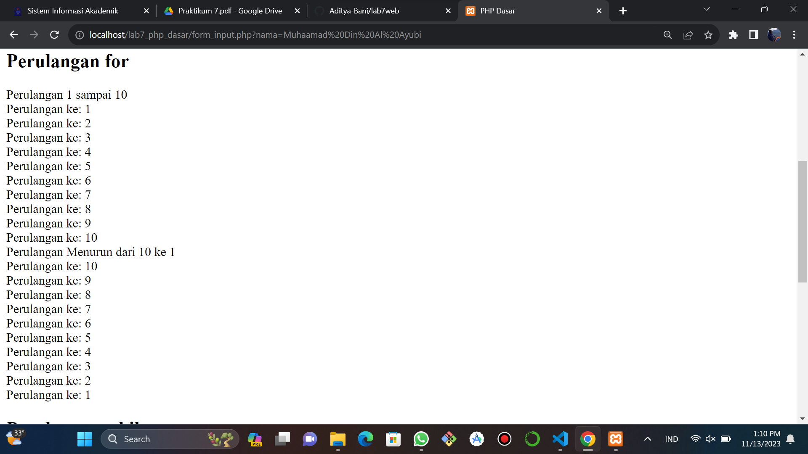
##### Perulangan while
```python
<h2>Perulangan while</h2>
<?php
echo "Perulangan 1 sampai 10 <br />";
$i=1;
while ($i<=10) {
    echo "Perulangan ke: " . $i . '<br />';
    $i++;
}
?>
```
##### Hasil Output
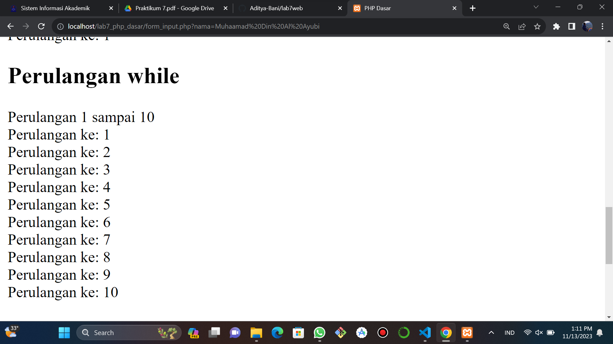
##### Perulangan dowhile
```python
<h2>Perulangan dowhile</h2>
<?php
echo "Perulangan 1 sampai 10 <br />";
$i=1;
do {
echo "Perulangan ke: " . $i . '<br />';
$i++;
} while ($i<=10);
?>
</body>
</html>
```
##### Hasil Output
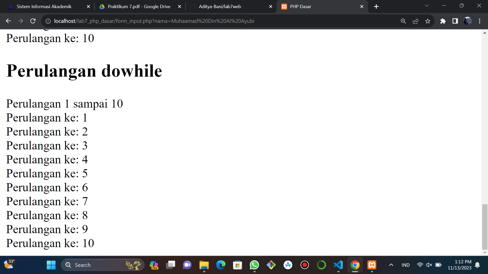
## Pertanyaan dan Tugas
##### Buatlah program PHP sederhana dengan menggunakan form input yang menampilkan nama, tanggal lahir dan pekerjaan. Kemudian tampilkan outputnya dengan menghitung umur berdasarkan inputan tanggal lahir. Dan pilihan pekerjaan dengan gaji yang berbeda-beda sesuai pilihan pekerjaan.
##### Input
```python
<!DOCTYPE html>
<html lang="en">

    <head>
        <title>Form Input</title>
        <meta charset="utf-8">

        <!-- CSS -->
        <style>
        body {
            width: 100%;
            height: 100vh;
            margin: 0;
            font-family: tahoma;
            font-size: 16px;
        }
        h1, p {
            margin: 1em auto;
            text-align: center;
        }
        form {
            width: 60vw;
            max-width: 500px;
            min-width: 300px;
            margin: 0 auto;
            padding-bottom: 2em;
            }
        label {
            display: block;
            margin: 0.5rem 0;
        }
        button[type="submit"] {
            display: block;
            width: 60%;
            margin: 1em auto;
            height: 2em;
            font-size: 1.1rem;
            background-color: #e0daca;
            border-color: white;
            min-width: 300px;
        }
        </style>
    </head>

    <body>
        <h1 id="title">Survey Formulir Pekerjaan dan Gaji</h1>
        <p id="description"><i>Melansir dari situs <a href="https://id.indeed.com/career/php-developer/salaries"> indeed.com</a></i></p>

        <form id="survey-form" action="" method="POST">
            <fieldset>
                <label>Nama: 
                    <input type="text" name="nama" required/>
                </label>
                <label>Tanggal lahir: 
                    <input type="date" name="date">
                </label>
                <label>Pekerjaan: 
                    <label>
                    <input type="radio" name="job" value="0"/>Database Administrator
                    </label>
                    <label>
                    <input type="radio" name="job" value="1"/>Software Developer
                    </label>
                    <label>
                    <input type="radio" name="job" value="2"/>Web Developer
                    </label>
                </label>
                <button type="submit" name="submit">Kirim</button>
            </fieldset>
            <fieldset>
                <?php
                if( isset($_POST['submit']))
                {
                    $nama = $_POST['nama'];
                    $date = $_POST['date'];
                    $job = $_POST['job'];


                    $date_user = new DateTime($date);
                    $today =  new DateTime('today');
                    $usia = $today->diff($date_user)->y;

                    $job_array = ["Database Administrator","Software Developer","Web Developer"];
                    $salary_array = ["Rp. 5.300.000","Rp. 5.400.000","Rp. 4.800.000"];


                    echo "Halo, ".$nama."<br>Kamu lahir pada tanggal ".$date.", Usia mu ".$usia." tahun";
                    echo "<br>Pekerjaan yang kamu pilih adalah ".$job_array[(int)$job].", dengan penghasilan kurang lebih ".$salary_array[(int)$job];
                }
                ?>
            </fieldset>
        </form>
    </body>
</html>
```
##### Hasil Output
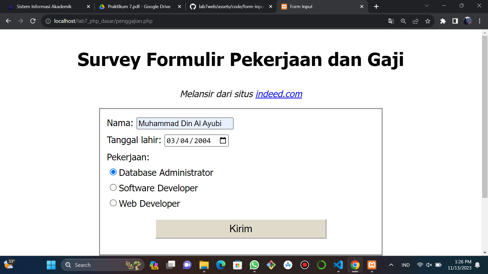
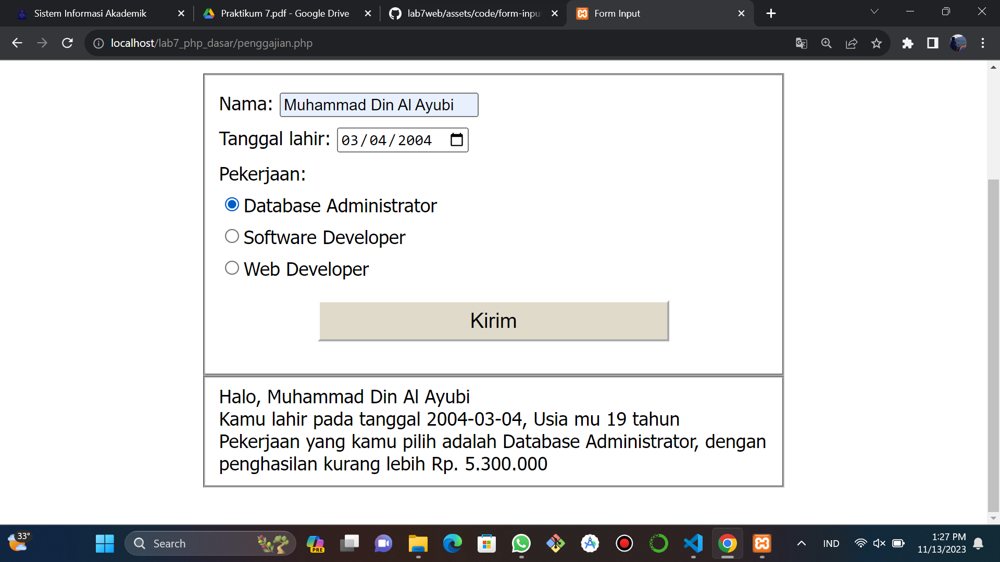
### Laporan Praktikum
1. Buatlah repository baru dengan nama Lab7Web.
2. Kerjakan semua latihan yang diberikan sesuai urutannya.
3. Screenshot setiap perubahannya.
4. Buatlah file README.md dan tuliskan penjelasan dari setiap langkah praktikum
beserta screenshotnya.
5. Commit hasilnya pada repository masing-masing.
6. Kirim URL repository pada e-learning ecampus